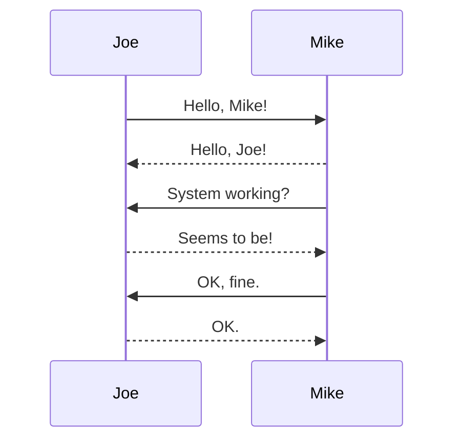

%{
  author: "Tomasz Kowal",
  description: "Step by step instructions to integrate mermaidjs with NimblePublisher",
  title: "Integrate Mermaid with NimblePublisher in two lines of code",
  tags: ["elixir", "phoenix"],
  published: true
}
---

José Valim, the creator of [Elixir programming language](https://elixir-lang.org/) and [Livebook](https://livebook.dev/), also participated in a suite of "Nimble*" libraries. The common trait of those projects is minimalism and focus.

One of those libraries is [NimblePublisher](https://github.com/dashbitco/nimble_publisher). The library integrates with [Phoenix framework](https://www.phoenixframework.org/), creating a blogging platform that is very pleasant to use by developers. You can specify blog posts in markdown, and it supports syntax highlighting for code snippets out of the box. It is super fast because it compiles blog posts to in-memory HTML. I used it to build this blog.

I also like using charts when communicating ideas, so I wanted to integrate [Mermaid](https://mermaid.js.org/). Mermaid allows specifying diagrams in plain text and rendering them on the web. Many well-known services like [GitHub](github.com/), [Notion](https://www.notion.so) or [Obsidian](https://obsidian.md/) use it.

There are a couple of ways to integrate Mermaid, but given how fast NimblePublisher is, I didn't want it to make requests to external API. I tried to [bundle it with my blog](https://mermaid.js.org/intro/n00b-gettingStarted.html#_4-adding-mermaid-as-a-dependency). And it was more straightforward than I expected!

Here are the steps:
1. Install node (at least v16)
2. Install yarn
3. `cd assets`
4. `yarn add mermaid`
5. Add those two lines in `assets/js/app.js` 
```js
import mermaid from "mermaid";
mermaid.initialize({ startOnLoad: true });
```
That is it!

You can now define the chart in your post using the following syntax:

~~~markdown

~~~


