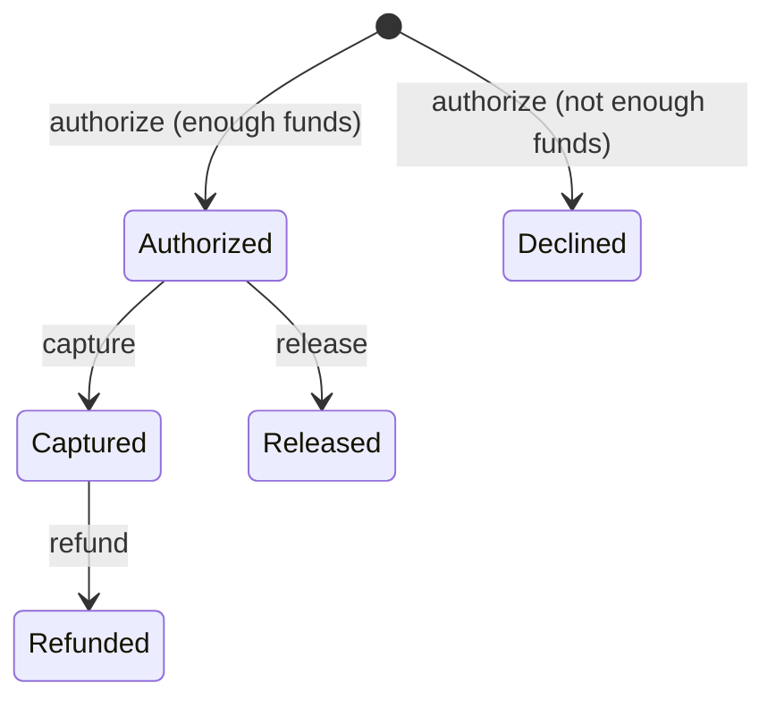
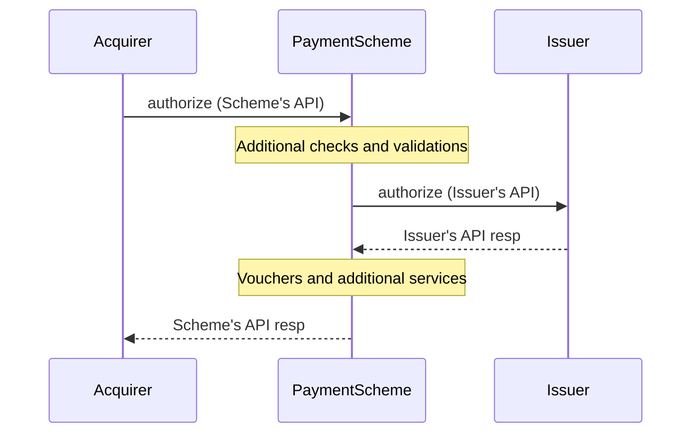

%{
  author: "Tomasz Kowal",
  description: "Part 1 of a five-part series on developing, testing, and maintaining HTTP APIs in Phoenix.",
  title: "Developing and Testing Payment APIs with Phoenix - the MEDIC approach",
  tags: ["elixir", "phoenix"],
  published: true
}
---
# Introduction

[Bluecode](https://bluecode.com/en/) is a payment scheme used mostly in Austria and Germany.
Payment schemes enable communication between acquirers, issuers, and users. If you’ve ever paid with a credit card or phone, you've used a payment scheme.

Providing connectivity often requires translating between different APIs. There are many standards, but the data is often similar because all participants send similar messages: authorization (blocking funds), capture (actual payment), release (if you don’t want to capture), and refund (if you captured but want to reverse). Ignoring multiple partial captures, it is something like this:



That means a payment scheme needs to be a “smart proxy”. Sometimes it needs to remember some data between requests. Sometimes, it requires understanding the state to enrich requests. Anyway, it is not just mapping fields. The system needs to be aware of the rules.



In this article, I'll cover how to efficiently test those kinds of APIs including mocking and evolution, and making sure, we can evolve them over time.
# Existing approaches

The default Phoenix generators can generate a CRUD JSON API. However, those are mostly learning tools, so the tests are super simplistic:
- prepare the database
- call API
- check the database

Saša Jurić, in his talk [“Clarity”](https://www.youtube.com/watch?v=6sNmJtoKDCo) and his [blog post series](https://medium.com/very-big-things/towards-maintainable-elixir-testing-b32ac0604b99), advocates for using test helpers and only checking observable behavior in tests. LINK

It means that for testing updating a resource, your test would create it via an API, update it via an API, and check if it is indeed updated via an API.

Those tests are weird for purists. They are definitely not unit tests because they combine many endpoints. They are neither black box nor end-to-end tests because we use controllers and route helpers.

I am going to call them “controller-level tests”. Their superpower is that they are as fast to execute as unit tests but don’t introduce coupling to storage. At Bluecode, we are migrating towards event-based architecture, and I don’t want to imagine how much work it would be if our primary way of testing was the three-step: “prepare DB, API call, check DB” approach.

However, even with helpers outlined by Sasa. It is still tedious to test all edge cases of a refund because every test would always need to make the same set of steps:
- mock issuer authorization success response
- call authorization
- mock issuer capture success response
- call capture
- mock issuer refund edge case
- call refund
- check refund edge case response

Imagine we have ten edge cases to test. That is a lot of test code. Imagine that our partner has changed one field in the authorization endpoint. That’s a lot of tests to fix. Clearly, *there must be a better way*.

# Part 1: Code generation

Migrating to a new version of Issuer's API might be a real chore. Just renaming one field could be tedious. Especially when the field name is similar to one in other APIs like "merchant_name". Thankfully, Elixir has structs producing compile errors in all places where we renamed a field or changed the nesting level.

We define an embedded schema and a changeset for each API endpoint.

All controller actions look like this:

```elixir
action_fallback :fallback

def pay(conn, params) do
  with {:ok, request} <- PayRequest.new(params),
       {:ok, response} <- CoreModule.pay(request.amount) do
    json(conn, response)
  end
end

defp fallback(conn, {:error, %Changeset{}} = error) do
  MyAppWeb.FallbackController.call(conn, error)
end
```

The `new` function is a small wrapper on top of `changeset`:
```elixir
  def new(params) do
    changeset(%__MODULE__{}, params)
    |> apply_action(:build)
  end
```

However, building all the embedded schemas needed for those would be pretty tedious. We used OpenAPI spec `.yaml` files to document APIs internally, so we figured we could generate validators from them.

This is the opposite of how people usually use specs. Usually, developers add macros in their controllers that generate the OpenAPI spec automatically and serve as documentation. We do the opposite because we often need to integrate the APIs from the client and server perspective.

Parsing OpenAPI spec to generate schemas unlocks more superpowers like automatically generating request and response examples that are useful during development and testing.

I'll cover that in Part 2.
